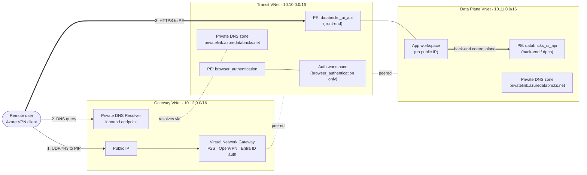

# dbx-azure-mlops

A reference Terraform project that deploys an **Azure Databricks workspace with no public network exposure** into someone's Azure subscription. The workspace is reachable only through a private VPN tunnel; all Databricks control-plane traffic flows over Azure Private Link.

It is built as a teaching repo — every stage is small, self-contained, and documented so you can read the code, follow what each resource does, and apply the same pattern on a real customer engagement.

> **Status:** working reference deployment. The list of [planned improvements](#planned-improvements) at the end is the backlog of things this repo intentionally does not yet do.

---

## What you end up with

After running all four stages you will have:

- Three resource groups (`gateway`, `transit`, `dataplane`) and a fourth for Terraform state.
- Three virtual networks, peered so the user's VPN traffic can reach the Databricks UI.
- A Point-to-Site (P2S) VPN gateway authenticated against Microsoft Entra ID — no certificates to distribute.
- An Azure DNS Private Resolver in the gateway VNet so the VPN client can resolve private addresses.
- Two Databricks workspaces — the **app workspace** that users actually use, and a small **auth workspace** used only for the browser-authentication leg of Private Link.
- Private Endpoints for `databricks_ui_api` (front-end and back-end) and `browser_authentication`.
- A serverless SQL Warehouse, deployed *into* the workspace via the Databricks provider.



---

## Repository layout

```
terraform/
├── 0-structure/   bootstrap: resource groups + remote state storage account
├── 1-network/     three VNets, peerings, NSGs, Private DNS zones, VPN, resolver
├── 2-workspace/   two Databricks workspaces + three Private Endpoints
└── 3-databricks/  in-workspace resources via the databricks provider (SQL warehouse, …)
```

Each stage has its own `*.md` next to the `.tf` files explaining the *why*. Stages run in order; each one writes its state to the storage account created in stage 0 and the next stage reads it back through `terraform_remote_state`.

---

## How the network actually works

The networking is the part that takes the longest to internalise. It's worth slowing down here.

### 1. Three VNets, one job each

| VNet | Purpose | What lives in it |
|---|---|---|
| **Gateway** | The way *people* enter the network | VPN gateway, public IP, DNS Private Resolver |
| **Transit** | The way *traffic* reaches Databricks | Front-end and auth Private Endpoints, Private DNS zone, the auth workspace |
| **Data Plane** | Where the workspace and clusters actually run | App workspace (with `no_public_ip`), back-end Private Endpoint |

Splitting them this way mirrors what you typically see on a customer engagement: the platform team owns the gateway, the networking team owns transit, and the data team owns the data plane. You can re-implement any one of them independently.

### 2. Peerings

- `gateway ↔ transit` with `allow_gateway_transit` on the gateway side and `use_remote_gateways` on the transit side. Transit can reuse the VPN gateway without owning it.
- `transit ↔ dataplane` (not in the diagram for clarity) — added by stages 1/2 so the front-end PE in transit and the back-end PE in dataplane can both be reached by the same client session.

### 3. The two private DNS zones

There are **two** private DNS zones with the same name (`privatelink.azuredatabricks.net`), one in `transit` and one in `dataplane`:

- The transit zone is linked to the gateway and transit VNets. When a VPN client looks up the workspace URL, it hits this zone via the resolver.
- The dataplane zone is linked to the dataplane VNet. It's used by clusters when they call back to the workspace control plane through the back-end Private Endpoint.

This split is deliberate: the front-end and back-end Private Endpoints map the same hostname to *different* private IPs, so they need separate zones.

### 4. DNS resolution from a VPN client

This is the most surprising part for newcomers. The Azure VPN client does **not** automatically use the resolver — you have to tell it to:

```xml
<clientconfig>
  <dnssuffixes>
    <dnssuffix>.azuredatabricks.net</dnssuffix>
  </dnssuffixes>
  <dnsservers>
    <dnsserver>10.12.1.4</dnsserver>  <!-- IP of the resolver inbound endpoint -->
  </dnsservers>
</clientconfig>
```

End-to-end, when you click your workspace URL on a connected machine:

1. The OS sees `*.azuredatabricks.net` and uses the resolver IP from the VPN profile as DNS server.
2. The resolver's inbound endpoint receives the query inside the gateway VNet.
3. Because the transit zone is linked to that VNet, Azure-provided DNS (168.63.129.16) returns the private IP of the front-end Private Endpoint.
4. Your browser opens HTTPS to that private IP across the peering.
5. The Databricks login flow performs a second resolution against `<region>.pl-auth.azuredatabricks.net`, which lands on the `browser_authentication` Private Endpoint of the auth workspace.

If any one of those four pieces is misconfigured you get a confusing failure mode (loops to the public login page, certificate warnings, or "site cannot be reached"). The order to debug is always: **VPN connected → DNS resolves to a 10.x address → TCP/443 reaches that address**.

---

## Customer environments: Conditional Forwarders vs. Private Resolver

This repo provisions a Private Resolver because the lab has no on-prem DNS to integrate with. **In a real customer environment you almost never deploy a new Private Resolver per workload** — you use what's already there.

The pattern most enterprises run looks like this:

- The customer already has on-premises DNS (Active Directory–integrated, BIND, Infoblox, etc.).
- Their hub VNet already has either an existing Private Resolver or a DNS forwarder VM.
- They centrally host the `privatelink.*` zones and link them to the hub.

The integration step is a single **conditional forwarder** on the on-prem DNS server pointing the public Databricks zone at the resolver's inbound endpoint:

| Source zone | Forward to | Notes |
|---|---|---|
| `azuredatabricks.net` | resolver inbound endpoint IP, e.g. `10.10.0.4` | Forward the **public** zone, not `privatelink.azuredatabricks.net`. The CNAME from `<workspace>.azuredatabricks.net` → `<workspace>.privatelink.azuredatabricks.net` is what triggers the private DNS zone lookup in Azure. ([MS docs](https://learn.microsoft.com/azure/private-link/private-endpoint-dns-integration)) |

For this repo, that means in a customer deployment you would normally:

1. **Skip** the `azurerm_private_dns_resolver*` and `azurerm_subnet "resolver"` resources in `terraform/1-network/gateway-vnet.tf`.
2. **Skip** the VPN gateway entirely if the customer already has ExpressRoute or a site-to-site VPN — the VNet just needs to be reachable.
3. **Link** the two private DNS zones in this repo to the customer's hub VNet (not a new gateway VNet).
4. Have the customer's networking team add the conditional forwarder above on their on-prem DNS.

A future iteration of this repo will gate the resolver and VPN behind an input variable so the same code can deploy in either mode (see [planned improvements](#planned-improvements)).

---

## Prerequisites

- An Azure subscription where you have **Owner** (you create role assignments and resource groups).
- A Microsoft Entra ID tenant where you can authenticate users for the VPN.
- [Terraform](https://developer.hashicorp.com/terraform/install) ≥ 1.6 and the [Azure CLI](https://learn.microsoft.com/cli/azure/install-azure-cli).
- Quotas: Premium Databricks workspace SKU is required for Private Link.
- A Unity Catalog metastore in your region (created once per region per tenant) — stage 3 expects to attach to one.

---

## Deploying

> The subscription ID and tenant ID are currently hard-coded in `providers.tf` and `vars.tf` as defaults. Override them with a `*.tfvars` file or `-var` flag — they are intentionally not removed in this PR but will be parameterised in a follow-up.

```bash
# Authenticate
az login
az account set --subscription <your-subscription-id>

# Stage 0: bootstrap (uses a LOCAL state file — run once, by hand)
cd terraform/0-structure
terraform init
terraform apply
# Note the tfstate_account_name output and grant yourself "Storage Blob Data Owner"
# on the new storage account. Stages 1–3 use Entra-based access (use_azuread_auth=true).

# Stage 1: network
cd ../1-network
terraform init   # backend config already set in providers.tf
terraform apply

# Stage 2: workspaces + private endpoints
cd ../2-workspace
terraform init
terraform apply

# Stage 3: in-workspace resources
# (set var.workspace_url to the URL output by stage 2)
cd ../3-databricks
terraform init
terraform apply -var="workspace_url=https://<your-workspace>.azuredatabricks.net"
```

### Connecting to the workspace

1. Open the **Virtual Network Gateway** in `rg-dbx-ml-gateway`, go to **Point-to-site configuration**, and **Download VPN client**.
2. Unzip the bundle, edit `azurevpnconfig.xml`, and replace `<clientconfig/>` with the block in [the DNS section above](#4-dns-resolution-from-a-vpn-client). Use the IP shown on the resolver's **Inbound endpoints** blade.
3. Import the edited file into the Azure VPN Client and connect — you will be prompted to sign in with Entra ID.
4. Browse to the workspace URL output by stage 2.

If the page loops back to a public login screen, your DNS is going around the resolver — disconnect any other VPN clients and check that `nslookup <workspace-url>` returns a `10.x` address.

---

## Planned improvements

This repo deliberately does not try to do everything at once. Tracked separately:

- **Parameterise tenant / subscription / region** — remove hard-coded IDs from `providers.tf` and `vars.tf`.
- **Toggle the resolver and VPN** — make `gateway-vnet.tf` opt-in via a variable so the same code deploys cleanly in a customer hub-and-spoke environment that already has DNS.
- **Reusable modules** — extract the workspace + endpoints pattern into a module that can be instantiated per environment (dev / staging / prod).
- **Unity Catalog stage** — a separate Terraform project for the metastore, catalogs, schemas, and storage credentials.
- **Cluster policies, instance pools, secret scopes** — add to stage 3.
- **DABS use cases** — bring in 1–2 end-to-end Databricks Asset Bundle examples (a streaming ETL pipeline and a model-training + serving job) so the deployed workspace has tangible workloads on it. Application code belongs in DABS, not Terraform.
- **CI** — `terraform fmt -check`, `terraform validate`, and `tflint` on PRs.
- **Cost guard** — small `azurerm_consumption_budget_resource_group` per RG so labs don't run up a bill if forgotten.
